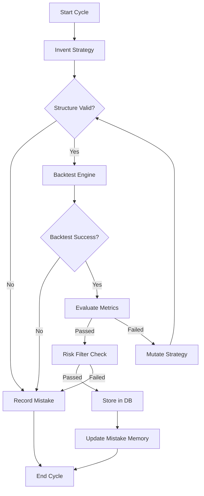

# Autonomous AI Options Strategy Research Engine

An elite, multi-agent quantitative research platform designed to autonomously discover, backtest, and evolve high-alpha options trading strategies for the Indian Index markets (NIFTY, BANKNIFTY, FINNIFTY).

---

## 🏗️ Project Overview

The **Autonomous AI Options Strategy Research Engine** is a production-grade quantitative discovery platform. It replaces traditional manual backtesting with an autonomous "evolutionary loop" where AI agents compete to find robust, non-overfitted trading strategies.

**Core Vision:**
- **Invention**: Automatically generate complex multi-leg options strategies using LLMs.
- **Rigor**: Validate strategies against real-world historical option chains (Greeks, IV, Spreads).
- **Evolution**: Use failure as fuel by mutating rejected strategies into resilient ones.
- **Research Focus**: Designed strictly for strategy discovery and quantitative validation.

> [!IMPORTANT]
> This system is built for **research and backtesting**. It does not currently support live execution and never generates synthetic data; it only operates on historical ground truth.

---

## 🧠 System Architecture

The engine is built on a tripartite foundation of modern AI and quantitative engineering:
- **Orchestration**: [LangGraph](https://python.langchain.com/docs/langgraph) manages the state machine and logical flow.
- **Intelligence**: [Ollama](https://ollama.ai/) provides local, private LLM inference for strategy logic.
- **Execution**: A vectorized Python backtesting engine optimized for multi-leg simulations.

### The Agentic Workflow
The system utilizes specialized agents, each with a distinct responsibility:
1. **StrategyInventorAgent**: The "Creative" — generates new strategy blueprints.
2. **StrategyValidatorAgent**: The "Gatekeeper" — ensures structural and logical integrity.
3. **BacktestAgent**: The "Executioner" — simulates the strategy on historical data.
4. **EvaluatorAgent**: The "Critic" — applies rigorous quantitative acceptance thresholds.
5. **StrategyMutatorAgent**: The "Optimizer" — evolves failed strategies based on performance gaps.
6. **LearningAgent**: The "Memory" — records mistakes to prevent future analytical "hallucinations."

---

## 🔄 Strategy Lifecycle



### 1. Invention & Schema
Strategies are generated as strict **Pydantic models**. Each strategy includes:
- **Option Legs**: Definitions for Buy/Sell, CE/PE, and Quantity Ratios.
- **Strike Selection**: Advanced logic supporting `ATM_OFFSET` (e.g., +100) or `DELTA_TARGET` (e.g., 0.30).
- **Market Regime Filters**: Logic to auto-filter based on IV Rank, Trend (ADX), or Volatility.

### 2. Multi-Leg Backtesting
The engine supports complex spreads (Iron Condors, Butterflies, Calendars). It calculates:
- **Intraday Simulation**: Tick-by-tick or OHLC resolution.
- **Greek Sensitive**: Incorporates Delta and Theta decay into simulation results.
- **Realistic Friction**: Deducts STT, GST, SEBI charges, and flat brokerage (INR 20/order).
- **Margin Modeling**: Accounts for capital requirements in short-selling.

---

## 📊 Data Pipeline

The system is a "Zero-Synthetic" platform. It relies entirely on local CSV archives located in the data directories.

### Data Schema
The loader processes full option chains with the following fields:
- **Identity**: `timestamp`, `expiry`, `strike`, `option_type (CE/PE)`
- **Price**: `open`, `high`, `low`, `close`, `ltp`
- **Greeks**: `delta`, `gamma`, `theta`, `vega`
- **Liquidity**: `bid`, `ask`, `volume`, `open_interest`
- **Volatility**: `iv` (Implied Volatility)

**Directory Structure Requirement:**
The loader expects data to be organized by index (e.g., `NIFTY DATA`, `BANKNIFTY DATA`) and handles daily or weekly file splits automatically.

---

## 🔬 Evaluation & Anti-Overfitting

Strategies are held to high institutional standards. A strategy is only "Accepted" if it passes:
1. **Statistical Significance**: Minimum trade sample (default 20+ trades).
2. **Profitability**: Minimum Profit Factor (1.4+) and Positive Expectancy.
3. **Risk Control**: Max Drawdown (under 12-15%) and Sharpe Ratio (1.2+).
4. **Walk-Forward Validation**: Each strategy is tested across 3+ distinct "OOS" (Out-of-Sample) windows to ensure the alpha is structural, not accidental.

---

## 🧬 Strategy Mutation

When a strategy fails evaluation (e.g., low Win Rate or high Drawdown), the **Mutator Agent** steps in. It analyzes the failure reason (provided by the Critic) and performs:
- **Structural Hedging**: Converting a naked short into a Credit Spread.
- **Volatility Filtering**: Restricting entries to high IV Rank environments.
- **Strike Optimization**: Shifting Delta targets to improve the Risk/Reward ratio.

---

## 📁 Project Structure

| Folder | Description |
| :--- | :--- |
| `agents/` | Logic for Inventor, Mutator, Validator, and Evaluator. |
| `backtesting/` | The core simulation engine and data loaders. |
| `strategies/` | Pydantic templates and LLM prompt engineering. |
| `graph/` | LangGraph definition (Nodes, Edges, State). |
| `database/` | SQLAlchemy models and repository for strategy persistence. |
| `memory/` | JSON and Vector-based storage for mistake tracking. |
| `logs/` | Detailed execution traces and performance reports. |

---

## 🚀 Running the System

### Prerequisites
1. **Ollama**: Install Ollama and pull the required model:
   ```bash
   ollama pull deepseek-v3.1:671b-cloud
   ```
2. **Python Environment**: Initialize the virtual environment and install dependencies.
   ```bash
   python -m venv venv
   .\venv\Scripts\activate
   pip install -r requirements.txt
   ```

### Execution
Run the evolution loop for a specific number of cycles:
```bash
python main.py --cycles 10 --type iron_condor
```

### Outputs
- **`trading_system.db`**: SQLite database containing all generated, accepted, and rejected strategies.
- **`logs/`**: Detailed logs of every backtest, trade execution, and agent rationale.
- **Mistake Memory**: Consult `memory/mistakes.json` to see how the system is self-correcting.

---

## 🛠️ Developer Notes / Decisions

- **Why No Synthetic Data?** Synthetic options data often misses the "skew" and "term structure" of real markets. We prioritize realism over volume.
- **Why Multi-Leg?** Modern alpha in options is rarely found in vanilla buying; it's found in structural spreads and volatility arbitrage.
- **State Persistence**: Using LangGraph allows us to resume complex multi-step "evolutionary" thoughts even if the process is interrupted.

---
**Developed by Antigravity AI for Professional Quantitative Research.**

How to search database
python -c "import sqlite3; conn = sqlite3.connect('trading_system.db'); print(conn.execute('SELECT passed, COUNT(*) FROM backtest_results GROUP BY passed').fetchall()); conn.close()"